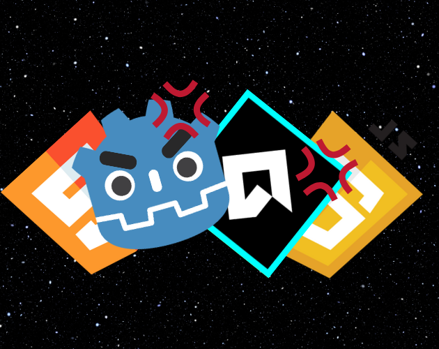

# Performance Tests for Godot vs GameMaker Studio 2 on the Web

This repository contains the results and details of performance tests conducted on the Godot and GameMaker game engines. The tests aim to evaluate the performance and efficiency of these platforms in a web environment.

## Godot Stress Test

### Overview

The Godot stress test was conducted using the open-source Godot engine version 3.5.3 Stable. The primary goal was to assess performance in terms of rendering, physics, and asset handling under high load conditions. Two scenes were used for this process, with a total of 4 nodes to ensure the desired functionality.

### How to Test

To run the Godot stress test, access the following link: [Godot Stress Test](https://huotes.itch.io/godot-stress-test)

## GameMaker Stress Test

### Overview

The GameMaker stress test was performed to analyze the engine's ability to handle intensive workloads, focusing on aspects such as game logic processing, graphic rendering, and resource optimization. I created two objects, one to create 10,000 cubes every second, and the other being the cube itself that will be generated.

### How to Test

To perform the stress test on GameMaker, access the link: [GameMaker Stress Test](https://huotes.itch.io/gamemaker-stress-test)

## Results and Analysis

Detailed results, performance metrics, and in-depth analyses can be found in the corresponding directories for each engine.

- [Godot Results](./godot_results)
- [GameMaker Results](./gamemaker_results)

## Test Environment Configuration

The tests were conducted through my itch.io page, where I placed the games on my profile and decided to see which game overloaded it first.

## Contribution

Feel free to contribute with your own tests, code improvements, or bug fixes. Refer to the [CONTRIBUTING.md](./CONTRIBUTING.md) file for information on how to contribute.
